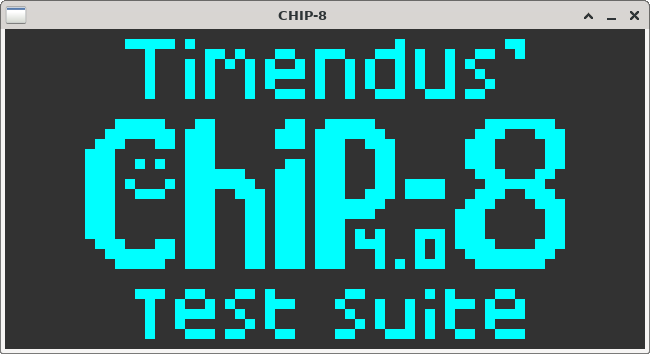
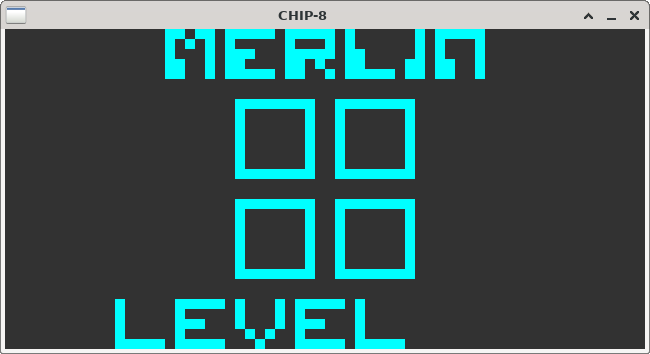
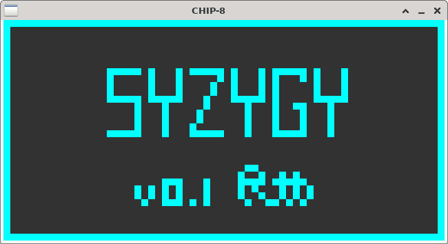

# chip8cl - Hackable CHIP-8 Emulator in Common Lisp

The CHIP-8 is a popular virtual machine originally developed by Joseph
Weisbecker in the mid 70's. It's been ported to early
microcontrollers, C64, and even in a Super Famicom cartriage.

### Key Mapping

| Key | CHIP-8 |
|-----|--------|
| 1   | 1      |
| 2   | 2      |
| 3   | 3      |
| 4   | C      |
| q   | 4      |
| w   | 5      |
| e   | 6      |
| r   | D      |
| a   | 7      |
| s   | 8      |
| d   | 9      |
| f   | E      |
| z   | A      |
| x   | 0      |
| c   | B      |
| v   | F      |

## Why would you write another CHIP-8 emulator?

While CHIP-8 emulators are not that hard to write, I think it's a good
project to learn a programming language. It's a single project that is
challenging enough that it can propel you to
high-beginner/low-intermediate level in language in one step.

### Status / TODOs

- Upcomming blog post on experience (Lispers will enjoy it ^^)
- A few minor opcodes not working, mostly due to conflicting
  documentation and me being lazy

### References

- https://tobiasvl.github.io/blog/write-a-chip-8-emulator/
- https://github.com/Timendus/chip8-test-suite
- https://laurencescotford.com/chip-8-on-the-cosmac-vip-keyboard-input/
- https://chip-8.github.io/extensions/
